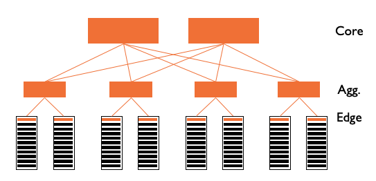

# Summary of "Flat Datacenter Storage"
Xiangfeng Zhu(zxfeng)

## Problem and Motivation

### Oversubscription
Switch ports and cabling have both monetary cost and an operational cost in data centers. Imagine you have to wire 1000s machines together. How would you do it? The following figure shows the dominant design pattern for data-center architecture today(2012). 

 
*image_caption*

As shown in the above figure, the network is a tree-like hierarchy reaching from a layer of servers in racks at the bottom to a layer of core routers at the top. Orange rectangles represent switches. Unfortunately, this conventional design suffers from a fundamental limitation: Limited server-to-server capacity(i.e., oversubscription).
As we go up the hierarchy, we are confronted with steep technical and financial barriers in sustaining high bandwidth. Thus, as traffic moves up through the layers of switches and routers, the over-subscription ratio increases rapidly. Top-level switches can be oversubscribed by up to 240x(according to the VL2 paper), meaning that only one in 240 machines can send data across the top level to the other side at a time. 

This paper provides more detailed explanation. 

### Disk Locality
The conventional wisdom in big-data processing systems(e.g., MapReduce) is to move computation to the data(i.e. respect data locality) because of the problem of oversubscription. Although some works(e.g., Delay Scheduling) try to solve this issue, location-awareness adds complexity to the scheduler. 

### CLOS network 
However, recently developed CLOS networks have made it economical to build non-oversubscribed full bisection bandwidth networks at the scale of a datacenter. 
The main consequence is that there is no distinction between local disk and remote disk, since the network bandwidth is roughly equal to the network bandwidth. (However, note that memory bandwidth is still two orders of magnitude than the disk and network bandwidth). Thus, we can have much simpler work schedulers and programming models. 
Another consequence of such design is that high disk-to-disk bandwidth can also facilitate fast recovery from disk and machine failures. 

## Hypothesis

## Solution Overview

## Limitations and Possible Improvements

## Summary of Class Discussion
